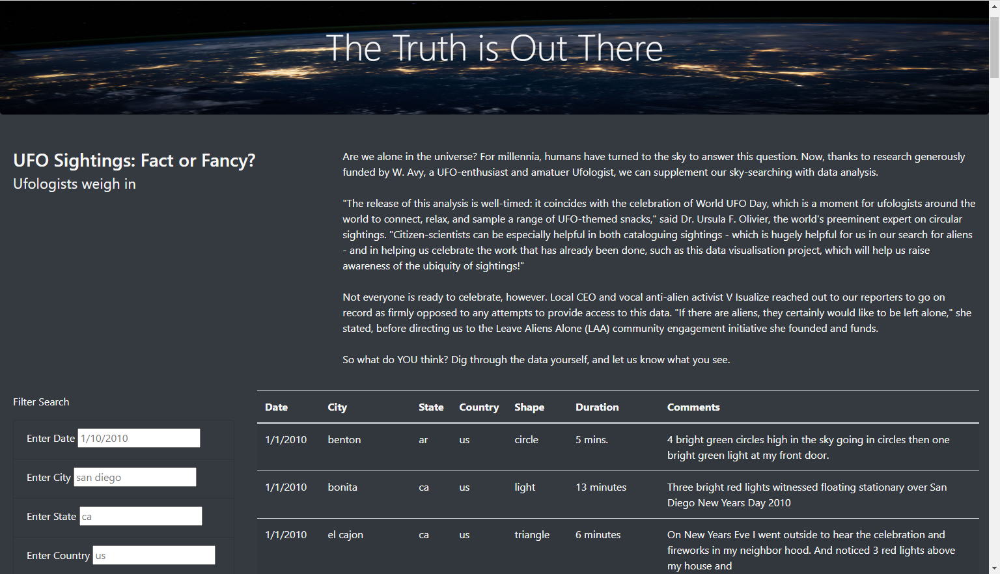
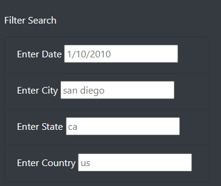
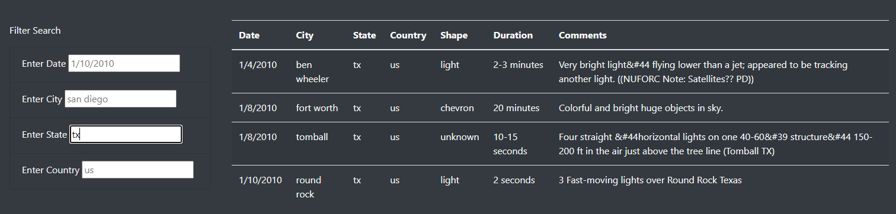

# UFO sightings using javascript and HTML

## Overview of Project

The purpose of this study is to creat a website using HTML and CSS to present a table of UFO sightings. The table can be filtered and the background Javascript code is responsible to generate the new table. The final website is shown in the next figure.

## Results:
To use the website start by using the input box on left corner of the website. Put the country code name, state, city or a date to filter the data. For countries and states, use their alpha codes. A sample of the input parameter is given for San diego, California (ca) and United States (us).

Here is an example of the filtered data for the state of Texas (tx).

## Summary: 
One drawback of the website is that it does not show the distribution of sighting on a map. In addition user search options are not shown, country code names can help the user experience. 
One improvment tha could greatly change the website experience is to add a map distribution of the results in the website. This way it can be seen which states or cities have more sightings than others. Another improvement is additional filters added to website for shape and duration.
